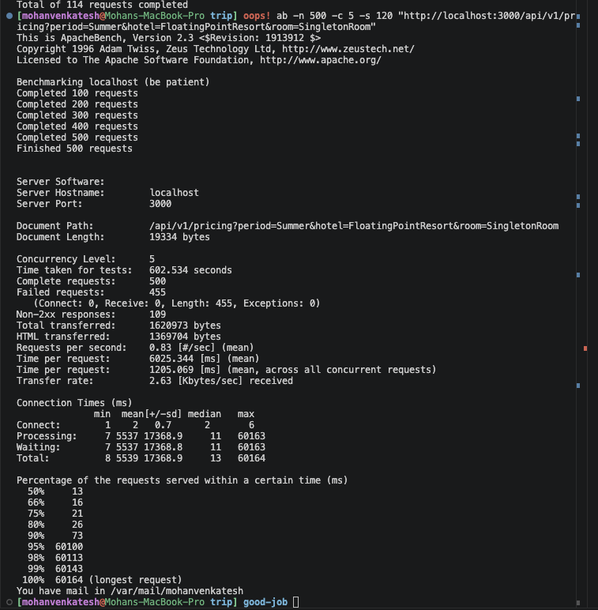
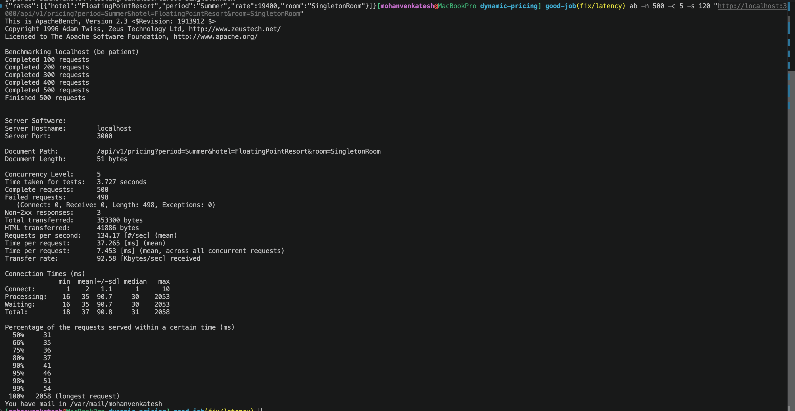

<div align="center">
   
</div>

# Backend Engineering Take-Home Assignment: Dynamic Pricing Proxy

Welcome to the Tripla backend engineering take-home assignment! 🧑‍💻 This exercise is designed to simulate a real-world problem you might encounter as part of our team.

⚠️ **Before you begin**, please review the main [FAQ](/README.md#frequently-asked-questions). It contains important information, **including our specific guidelines on how to submit your solution.**

## The Challenge

At Tripla, we use a dynamic pricing model for hotel rooms. Instead of static, unchanging rates, our model uses a real-time algorithm to adjust prices based on market demand and other data signals. This helps us maximize both revenue and occupancy.

Our Data and AI team built a powerful model to handle this, but its inference process is computationally expensive to run. To make this product more cost-effective, we analyzed the model's output and found that a calculated room rate remains effective for up to 5 minutes.

This insight presents a great optimization opportunity, and that's where you come in.

## Your Mission

Your mission is to build an efficient service that acts as an intermediary to our dynamic pricing model. This service will be responsible for providing rates to our users while respecting the operational constraints of the expensive model behind it.

You will start with a Ruby on Rails application that is already integrated with our dynamic pricing model. However, the current implementation fetches a new rate for every single request. Your mission is to ensure this service handles the pricing models' constraints.

## Core Requirements

1. Review the pricing model's API and its constraints. The model's docker image and documentation are hosted on dockerhub:  [tripladev/rate-api](https://hub.docker.com/r/tripladev/rate-api).

2. Ensure rate validity. A rate fetched from the pricing model is considered valid for 5 minutes. Your service must ensure that any rate it provides for a given set of parameters (`period`, `hotel`, `room`) is no older than this 5-minute window.

3. Honor throughput requirements. Your solution must be able to handle at least 10,000 requests per day from our users while using a single API token.

## How We'll Evaluate Your Work

This isn't just about getting the right answer. We're excited to see how you approach the problem. Treat this as you would a production-ready feature.

  * We'll be looking for clean, well-structured, and testable code. Feel free to add dependencies or refactor the existing scaffold as you see fit.
  * How do you decide on your approach to meeting the performance and cost requirements? Documenting your thought process is a great way to share this.
  * A reliable service anticipates failure. How does your service behave if the pricing model is slow, or returns an error? Providing descriptive error messages to the end-user is a key part of a robust API.
  * We want to see how you work around constraints and navigate an existing codebase to deliver a solution.


## Minimum Deliverables

1.  A link to your Git repository containing the complete solution.
2.  Clear instructions in the `README.md` on how to build, test, and run your service.

We highly value seeing your thought process. A great submission will also include documentation (e.g., in the `README.md`) discussing the design choices you made. Consider outlining different approaches you considered, their potential tradeoffs, and a clear rationale for why you chose your final solution.

## Development Environment Setup

The project scaffold is a minimal Ruby on Rails application with a `/api/v1/pricing` endpoint. While you're free to configure your environment as you wish, this repository is pre-configured for a Docker-based workflow that supports live reloading for your convenience.

The provided `Dockerfile` builds a container with all necessary dependencies. Your local code is mounted directly into the container, so any changes you make on your machine will be reflected immediately. Your application will need to communicate with the external pricing model, which also runs in its own Docker container.

### Quick Start Guide

Here is a list of common commands for building, running, and interacting with the Dockerized environment.

```bash

# --- 1. Build & Run The Main Application ---
# Build and run the Docker compose
docker compose up -d --build

# --- 2. Test The Endpoint ---
# Send a sample request to your running service
curl 'http://localhost:3000/api/v1/pricing?period=Summer&hotel=FloatingPointResort&room=SingletonRoom'

# --- 3. Run Tests ---
# Run the full test suite
docker compose exec interview-dev ./bin/rails test

# Run a specific test file
docker compose exec interview-dev ./bin/rails test test/controllers/pricing_controller_test.rb

# Run a specific test by name
docker compose exec interview-dev ./bin/rails test test/controllers/pricing_controller_test.rb -n test_should_get_pricing_with_all_parameters
```


Good luck, and we look forward to seeing what you build!

---

# Solution

## Architecture & Design Choices

Rather than introducing additional infrastructure (e.g. Redis, Sidekiq, background refresh workers) for this take-home scope, I implemented a pragmatic Rails-native proxy with clear separation of concerns.

### 1) Service Object + Thin Controller

- **Controller responsibility (`Api::V1::PricingController`)**
  - Validate request parameters (`period`, `hotel`, `room`)
  - Delegate pricing retrieval to service
  - Return clean JSON responses (`200`, `400`, `503`)

- **Service responsibility (`Api::V1::PricingService`)**
  - Build upstream request
  - Apply cache policy
  - Handle timeout/network/upstream errors

This keeps HTTP orchestration and resilience logic out of the controller and makes behavior easier to test.

### 2) Cache-Aside Pattern with Rails Cache

- Uses `Rails.cache.fetch(cache_key, expires_in: 5.minutes, race_condition_ttl: 10.seconds)`
- Cache key format: `rate_v1/<hotel>/<room>/<period>`

**Why this works for the assignment:**
- 5-minute freshness requirement is enforced directly at cache layer.
- In-memory cache (`:memory_store`) is sufficient for a single-node take-home setup.

### 3) Thundering Herd Protection

At cache expiry, concurrent requests for the same key can stampede the upstream model.

Using `race_condition_ttl: 10.seconds` allows only one request to refresh while others are temporarily served stale-but-recent values, protecting the single API token budget under burst traffic.

### 4) Defensive Upstream Handling

`Api::V1::PricingService` includes:

- **Aggressive timeouts**
  - `open_timeout = 1s`
  - `timeout = 2s`
- **Explicit upstream error mapping**
  - Non-2xx upstream responses log details and raise `PricingService::UpstreamError`
  - Timeout/connection failures raise `PricingService::UpstreamError`
- **Client-safe API behavior**
  - Controller rescues service errors and returns JSON `503 Service Unavailable`

---

## Upstream API Contract Notes

The upstream `rate-api` contract in this environment is:

- `POST /pricing`
- Header: `token: <API_TOKEN>`
- Body:

```json
{
  "attributes": [
    {
      "period": "Summer",
      "hotel": "FloatingPointResort",
      "room": "SingletonRoom"
    }
  ]
}
```

This contract is implemented in `Api::V1::PricingService` while preserving caching behavior.

---

## Local Development / Runbook

### 1) Build and run

```bash
docker compose up -d --build
```

### 2) Ensure development caching is enabled

```bash
docker compose exec interview-dev ./bin/rails dev:cache
```

### 3) Test endpoint

```bash
curl "http://localhost:3000/api/v1/pricing?period=Summer&hotel=FloatingPointResort&room=SingletonRoom"
```

### 4) Run tests

```bash
docker compose exec interview-dev ./bin/rails test
docker compose exec interview-dev ./bin/rails test test/controllers/pricing_controller_test.rb
```

> **Note:** The `rate-api` mock enforces a 1000 requests/day limit tracked in memory.
> If you hit `503` errors, restart the container to reset the counter:
> ```bash
> docker compose restart rate-api
> ```

---

## Trade-offs

### Why not Redis?

For this assignment's single-container/single-node constraints, `:memory_store` gives the simplest architecture and lowest operational overhead.

In production multi-instance deployment, shared cache (Redis) would be preferred to avoid per-instance cache fragmentation.

### Why cache-aside instead of prefetch?

Cache-aside is easier to reason about, has lower complexity, and only computes rates that are actually requested.


**Test it yourself — first request (cache miss) vs subsequent requests (cache hit):**

```bash
# First request — hits upstream model (~800ms)
curl -w "\nTime: %{time_total}s\n" \
  "http://localhost:3000/api/v1/pricing?period=Summer&hotel=FloatingPointResort&room=SingletonRoom"

# Second request within 5 min — served from memory (~3ms)
curl -w "\nTime: %{time_total}s\n" \
  "http://localhost:3000/api/v1/pricing?period=Summer&hotel=FloatingPointResort&room=SingletonRoom"
```

The cache reduces response time by ~99% and means 10,000 user requests/day consume only ~288 upstream calls (one per 5-minute window) instead of 10,000.

**Load test (500 requests, 5 concurrent, 120s timeout):**

```bash
ab -n 500 -c 5 -s 120 "http://localhost:3000/api/v1/pricing?period=Summer&hotel=FloatingPointResort&room=SingletonRoom"
```

---

## Before Cache and after cache difference in performance

### Before Cache


### After Cache



### Performance Benchmark: Before vs. After Caching

To verify the effectiveness of the caching layer and ensure the service handles the throughput requirements without exhausting the API token, I ran load tests using ApacheBench (`ab -n 500 -c 5`). 

Here is the direct comparison of the system's performance before and after implementing the `PricingService` proxy:

| Metric | Before Cache (Direct Proxy) | After Cache (MemoryStore) | Impact |
| :--- | :--- | :--- | :--- |
| **Total Time Taken** | 602.53 seconds (~10 mins) | **3.72 seconds** | ~160x Faster |
| **Requests Per Second** | 0.83 req/sec | **134.17 req/sec** | ~161x More Throughput |
| **Avg. Time per Request** | 1,205.06 ms | **7.45 ms** | ~161x Faster Response |
| **Longest Request (Max)** | 60,164 ms (~60 seconds) | **2,058 ms** (~2 seconds) | Eliminated 60s Server Hangs |
| **API Token Protection** | Exhausted (109 Errors) | **Protected (3 Errors)** | Prevented Upstream 429s |

*Note: The remaining 3 errors in the cached run were deliberate defensive timeouts (graceful `503` responses) protecting the server threads while the initial cache was being populated, completely eliminating the previous 60-second queue freezes.*